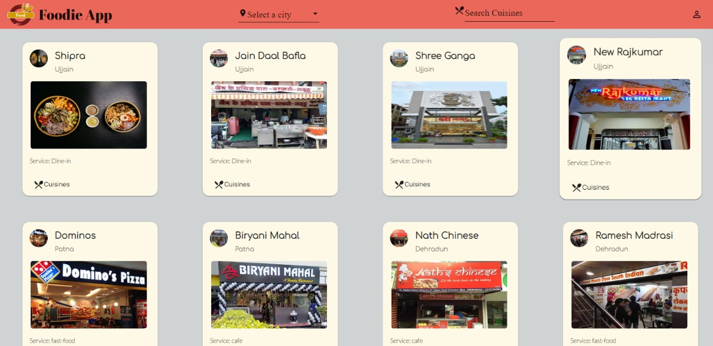
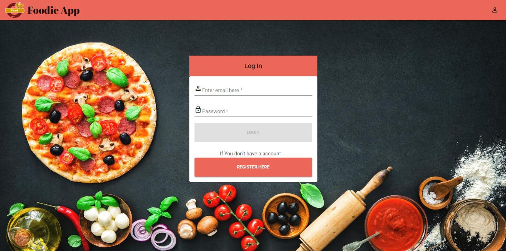
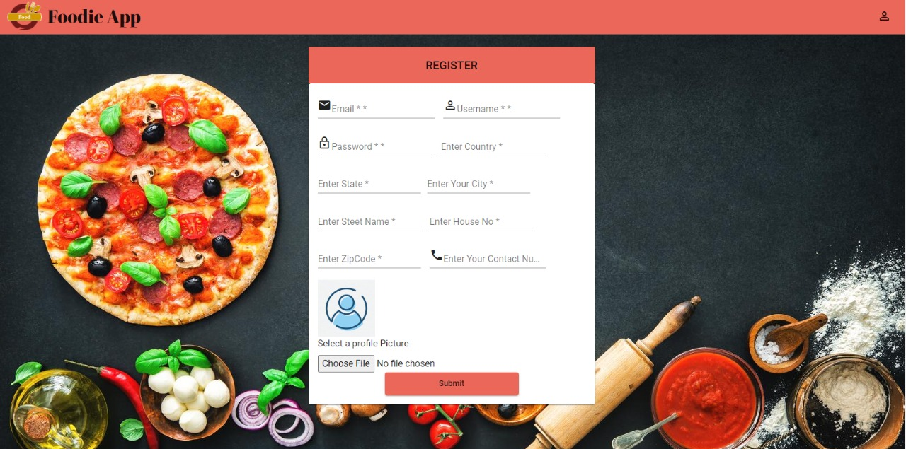
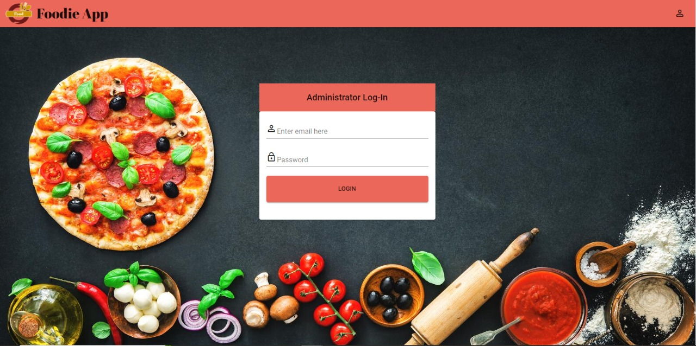
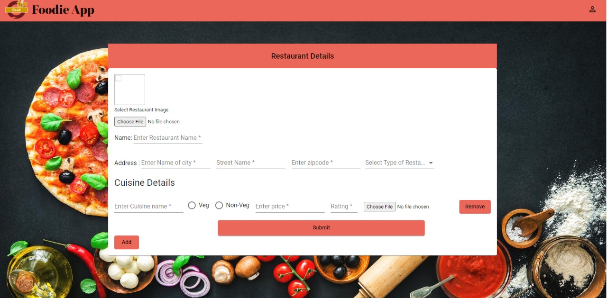
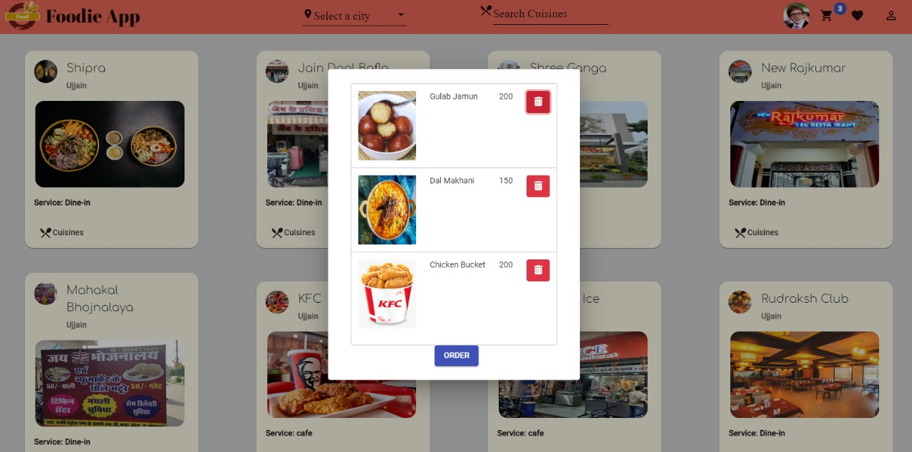

## Foodie App: A Delicious Journey for Food Lovers

Welcome to the Foodie App repository! This project is your one-stop shop for exploring and enjoying the culinary world. 

**What is Foodie App?**

Foodie App is a mobile application designed to be your companion on your gastronomic adventures.  Here's what it offers:

* **Restaurant Discovery:** Find amazing restaurants near you or browse by cuisine, location, or rating.
* **Menu Exploration:** View menus, photos, and user reviews to make informed dining decisions.
* **Reservation Management:** Easily book reservations at your favorite restaurants directly through the app.
* **Foodie Community:** Connect with other food enthusiasts, share recommendations, and discover hidden gems.

**Who is Foodie App for?**

* **Foodies of all levels:** Whether you're a seasoned gourmand or a curious newcomer, Foodie App caters to your culinary interests.
* **People who love exploring new restaurants:** Discover hidden gems, trendy hotspots, and everything in between.
* **Those seeking convenient reservation management:** Book tables seamlessly and avoid wait times.
* **Social butterflies who enjoy sharing food experiences:** Connect with fellow food enthusiasts and expand your culinary horizons.

**Getting Started:**

This repository currently holds the source code for the Foodie App. If you're a developer interested in contributing to the project, here's how to get involved:

1. **Clone the repository:**

   ```bash
   git clone https://github.com/adityaranjan08/Foodie-App.git
   ```

2. **Set up your development environment:**

   - Install necessary dependencies (likely mentioned in a requirements file or instructions within the code).
   - You might need additional tools like Android Studio or Xcode depending on the app's platform (Android or iOS).

3. **Explore the codebase:** The codebase structure will likely consist of separate folders for frontend (user interface), backend (server-side logic), and potentially database access.

4. **Contribute!** 
   - If you find bugs, feel free to submit bug reports.
   - If you have improvements or new features in mind, create pull requests with your contributions.

**Additional Information:**

* The readme file can mention any specific technologies used to develop the app (e.g., programming languages, frameworks). 
* If the app is publicly available on app stores (Google Play Store or Apple App Store), you can include links for download. 
* Consider including screenshots or a short demo video showcasing the app's functionalities.
* You can acknowledge any third-party libraries or APIs used in the app's development.

**Disclaimer:**

This readme assumes the repository contains the source code for a mobile Foodie App. If the content is different, adjust the details accordingly.

This comprehensive readme provides a clear overview of the Foodie App's purpose, target audience, and contribution guidelines. It also includes additional information that might be helpful for developers or potential users.


Seamless User Registration: Create an account and personalize your profile with an uploaded image.


Effortless Login: Login securely to access all the features the system offers.


Discover Delicious Options: Search for restaurants and cuisines based on your current location, making it easy to find what you're craving.


Build Your Favorites: Personalize your experience by favoriting your go-to restaurants or specific cuisines you love. Easily access them later in a dedicated "Favorites" section.


Convenient Cart System: Add and remove dishes from your cart with ease, allowing you to build your order exactly as you like before checkout.


    

     
